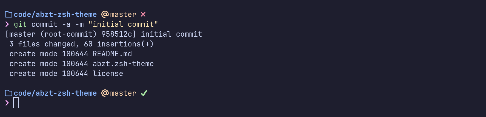

# Another Basic ZSH Theme

No nonsense ZSH theme with folder and git information. Looks great with Catppuccin.



## Prerequisites

* The Z shell - [installing zsh](https://github.com/ohmyzsh/ohmyzsh/wiki/Installing-ZSH)
* Oh-my-zsh framework - [oh-my-zsh](https://ohmyz.sh/)
* One of the Nerd Fonts - [nerdfonts](https://www.nerdfonts.com/)

## Installation

* Run the following command in the ZSH: 
    ```
    git clone https://github.com/stentibbing/abzt-zsh-theme.git $ZSH/custom/themes/abzt
    ```

* Change / add the line `ZSH_THEME="abzt"` in the .zshrc
